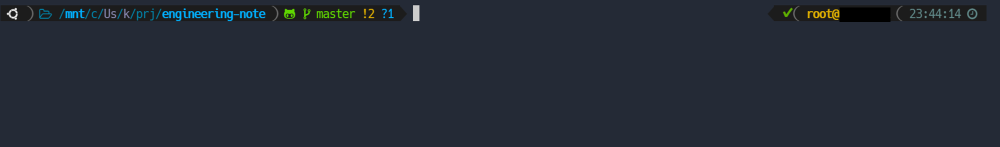

# zsh

========================================

zshの使い方

## 何故つかってみるのか

- Web系ではbash以外を使う的な文化があったりなかったり
  - 見た目がオシャンになる
    
  - bashより良さげな機能があるから
    - 補完機能(コマンドの途中で「これかい？」と表示してくる)とか便利


## Tips

### 導入

- install

  ```bash
  sudo apt-get install zsh
  ```

### プロンプトをかっこよくする

- install
  - [prezto](https://github.com/sorin-ionescu/prezto)

  ```zsh
  git clone --recursive https://github.com/sorin-ionescu/prezto.git "${ZDOTDIR:-$HOME}/.zprezto"

  setopt EXTENDED_GLOB
  for rcfile in "${ZDOTDIR:-$HOME}"/.zprezto/runcoms/^README.md(.N); do
    ln -s "$rcfile" "${ZDOTDIR:-$HOME}/.${rcfile:t}"
  done

  chsh -s /bin/zsh
  ```

- 設定
  - 下記ファイルを修正する

    ```zsh
    vi ${ZDOTDIR:-$HOME}/.zpreztorc
    ```

    - autosuggestionsを追加

      ```zsh
      zstyle ':prezto:load' pmodule \
      'environment' \
      'terminal' \
      'editor' \
      'history' \
      'directory' \
      'spectrum' \
      'utility' \
      'completion' \
      'history-substring-search' \
      'prompt' \
      'autosuggestions'
      ```

    - promptをpowerlevel10kへ変更

      ```zsh
      zstyle ':prezto:module:prompt' theme 'powerlevel10k'
      ```

      - [powerlevel10k](https://github.com/romkatv/powerlevel10k)

    - フォントインストール
      - powerline用のフォントが文字化けないようにする
        - [HackGen](https://github.com/yuru7/HackGen)
      - ターミナルやらエディタのターミナルのフォントへ設定
        - VSCodeなら 設定で `terminal.integrated.fontFamily` を検索して、インストールしたフォントを設定すればＯＫ

    - `prompt -s powerlevel10k` 実行

### bashの設定を移行

  ```bash
  cat ~/.bash_profile >> ~/.zprofile
  ```

  ```text
  ※注意事項※
  下記あたりに関連する設定はzshでは読み込めずエラーとなるので除外するが吉
  source ~/git-prompt.sh
  source ~/git-completion.bash
  ```

#### zsh上の色確認方法

  ```bash
  for c in {000..255}; do echo -n "\e[38;5;${c}m $c" ; [ $(($c%16)) -eq 15 ] && echo;done;echo
  ```
